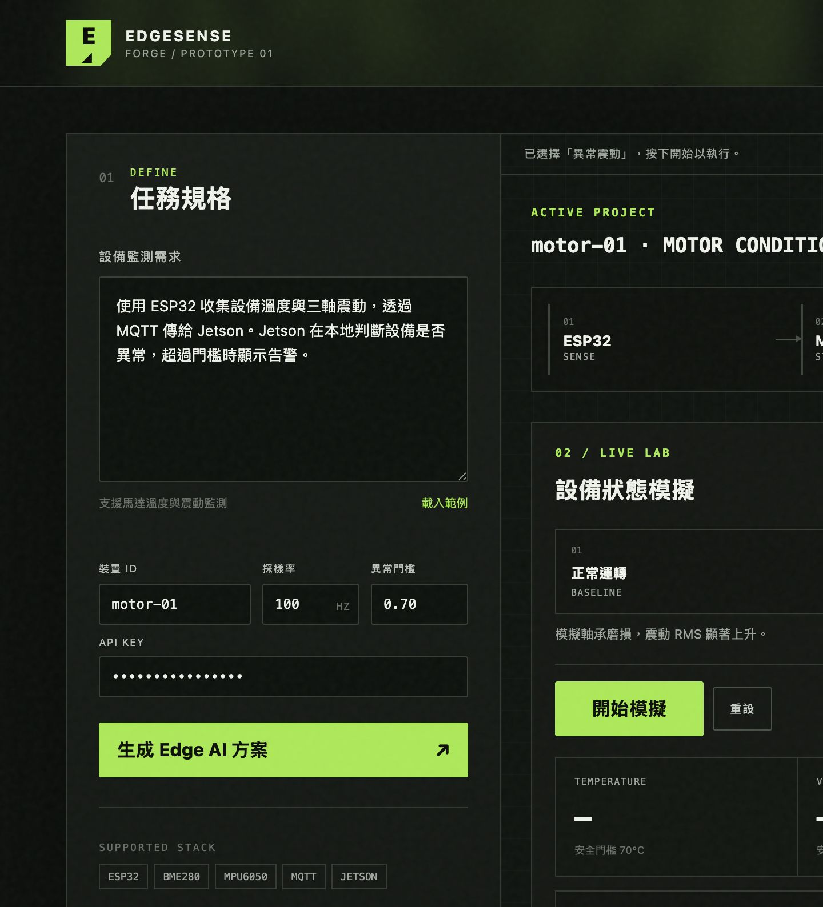
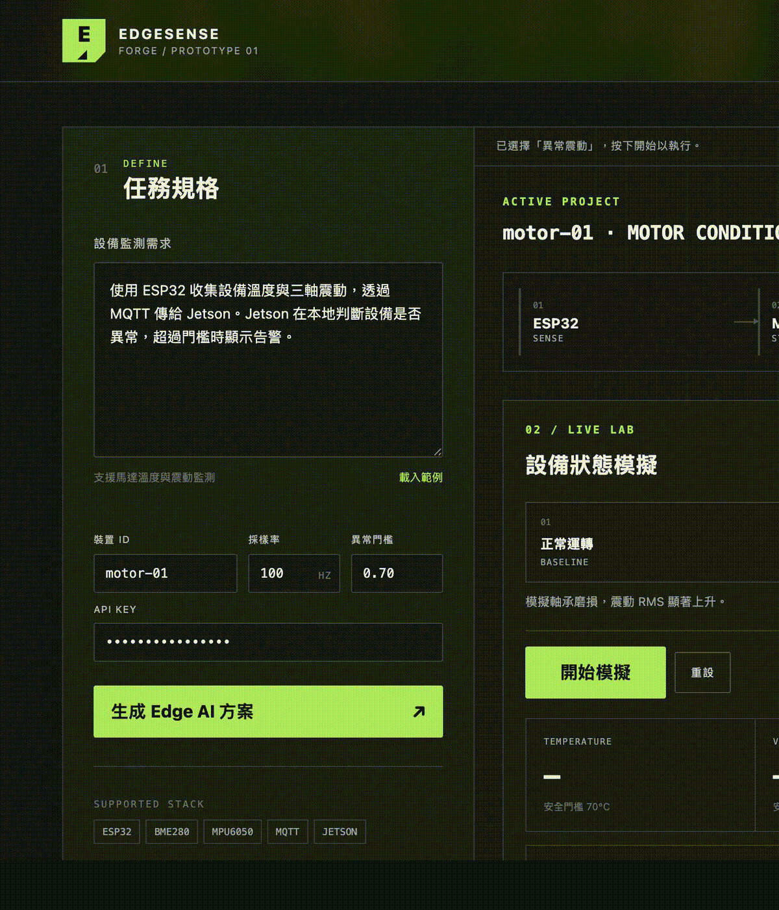

# EdgeSense Forge



> ESP32 sensors → MQTT → ONNX Runtime / TensorRT → PostgreSQL → operator alert workflow.



EdgeSense Forge 是一套以自然語言規劃 Edge AI 設備監測原型的開發工具。它把一段設備監測需求轉換成可檢查的感測器方案、MQTT 資料契約、Jetson 推論流程與部署產物。

目前狀態：Phase F 已加入 SQLite/PostgreSQL、retention、keyset pagination、告警工作流、Jetson 實機驗收包與作品集文件。

## 啟動 Prototype

```bash
cd /Users/junbinkuo/Documents/NVIDIA/edgesense-forge
python3 -m venv .venv
.venv/bin/pip install -r requirements-dev.txt

# Terminal 1：啟動 Mosquitto
mosquitto -c mosquitto/mosquitto.conf

# Terminal 2：啟動 FastAPI、WebSocket 與 Web UI
npm start
```

開啟 `http://localhost:8000`。頁首顯示 `EDGE SERVICE + MQTT` 後即可執行情境。

也可以使用 Docker Compose：

```bash
docker compose up --build
```

執行模型與規則測試：

```bash
npm test
```

## Phase A 文件

- [產品需求文件](docs/PRD.md)
- [使用流程](docs/USER_FLOWS.md)
- [系統架構](docs/ARCHITECTURE.md)
- [MVP 驗收標準](docs/ACCEPTANCE_CRITERIA.md)

## 一句話定位

讓 AI／IoT 開發者從一句設備監測需求，快速得到可模擬、可部署、可量測的 ESP32 + Jetson Edge AI 原型。

## 建議開發順序

1. ~~Web Prototype：需求輸入、方案結果、模擬資料與狀態頁。~~
2. ~~MQTT vertical slice：模擬裝置到 edge service 的真實資料流。~~
3. ~~Edge inference：ONNX Runtime 模型、TensorRT adapter 與 benchmark。~~
4. Benchmark 與作品集包裝：延遲、資源使用與 demo 情境。

## 模型與 Benchmark

模型 artifact 位於 `models/motor-anomaly-0.2/`。重新建立：

```bash
.venv/bin/python scripts/build_model.py
```

Dashboard 的 Benchmark 分頁會執行真正 ONNX Runtime warm-up 與測量。本機非 Jetson，因此 TensorRT 維持 `UNAVAILABLE`，不顯示模擬效能。

每次 benchmark 都會保存到 `data/edgesense.db`。歷史資料 API：

- `GET /api/history?device_id=motor-01&limit=120`
- `GET /api/anomalies?device_id=motor-01&limit=50`
- `GET /api/benchmarks?limit=50`
- `GET /api/history/summary`

資料庫可透過 `DATABASE_PATH` 改到掛載磁碟。SQLite 使用 WAL 模式，適合單機 edge prototype；多服務併發部署時再換 PostgreSQL。

## Jetson TensorRT

TensorRT `.plan` 必須在目標 Jetson 上建立，因為它和 JetPack、TensorRT、CUDA 與 GPU 架構相關：

```bash
chmod +x jetson/*.sh
./jetson/build_engine.sh
./jetson/benchmark_tensorrt.sh
.venv/bin/python jetson/compare_engines.py --warmup 20 --iterations 200
```

詳細條件與量測建議見 `jetson/README.md`。目前非 Jetson 環境只驗證腳本的 prerequisite failure，不產生或宣稱 TensorRT 效能數據。

完整實機驗收（可選擇 nvpmodel mode）：

```bash
./jetson/validate_on_jetson.sh       # 保留目前 power mode
./jetson/validate_on_jetson.sh 0     # 明確設定 mode 0，會要求 sudo
```

## PostgreSQL、retention 與壓測

`docker compose up --build` 會使用 PostgreSQL。單機啟動未設定 `DATABASE_URL` 時維持 SQLite。
Retention 預設 30 日，可用 `RETENTION_DAYS` 調整，或呼叫 `POST /api/retention/run?days=30`。

```bash
.venv/bin/python scripts/load_test.py --events 10000 --workers 4
DATABASE_URL=postgresql://... .venv/bin/python scripts/load_test.py --events 10000 --workers 8
DATABASE_URL=postgresql://... .venv/bin/python scripts/postgres_benchmark.py --sizes 10000 100000
DATABASE_URL=postgresql://... .venv/bin/python scripts/retention_job.py --days 30
```

Benchmark report 包含實際 `EXPLAIN ANALYZE` node、planning/execution time、buffer
統計與 `pg_stat_user_tables` maintenance evidence。Retention 成功執行會寫入
`retention_runs`，方便外部排程監控是否漏跑。

## 告警與作品集

Dashboard 的 `ALERTS` 分頁支援確認、完成、備註、規則與 CSV 匯出。作品集入口位於 `portfolio/README.md`。

## 安全與正式部署

設定 `API_KEY` 或 `API_KEY_FILE` 後，歷史、告警、規則、模擬與 benchmark API 都要求
`X-API-Key`。Dashboard 只用 key 交換短期 HttpOnly／SameSite session cookie，WebSocket
不傳送長期 key。輸入值僅保留於目前頁面記憶體，不寫入 localStorage。

正式 TLS／secret-file overlay：

```bash
docker compose -f docker-compose.yml -f docker-compose.secure.yml up --build
```

具備真實 DNS 後，以 Caddy 自動取得 HTTPS certificate：

```bash
export DEPLOY_DOMAIN=edgesense.example.com
export ACME_EMAIL=ops@example.com
docker compose -f docker-compose.yml -f docker-compose.secure.yml \
  -f docker-compose.production.yml up -d --build
python scripts/health_monitor.py --url "https://${DEPLOY_DOMAIN}/health/ready"
```

需要先準備 `secrets/README.md` 列出的憑證與 secret files。TLS 設定要求 Mosquitto
client certificate，不允許匿名連線。健康檢查：`/health/live` 與 `/health/ready`。

備份：

```bash
.venv/bin/python scripts/backup.py
DATABASE_URL=postgresql://... .venv/bin/python scripts/backup.py
```

## 真實環境驗收

PostgreSQL 10K／100K 寫入與 `EXPLAIN (ANALYZE, BUFFERS, FORMAT JSON)`：

```bash
DATABASE_URL=postgresql://... .venv/bin/python scripts/postgres_benchmark.py
```

透過已設定 SSH key 的 Jetson host 執行並抓回證據：

```bash
JETSON_HOST=user@jetson.local ./scripts/run_jetson_remote.sh
```

## ESP32 韌體

韌體位於 `firmware/`，使用與 edge service 相同的 MQTT telemetry schema。編譯：

```bash
cd firmware
../.venv/bin/pio run
```
