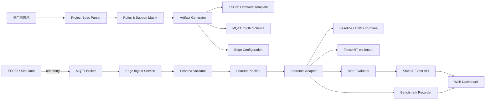

# EdgeSense Forge — 系統架構

## 1. 邏輯架構



## 2. MVP 元件

| 元件 | 責任 | MVP 技術建議 |
|---|---|---|
| Web UI | 需求輸入、方案、Live Lab、benchmark | Vite + React + TypeScript |
| Project Spec | 儲存可重現的方案狀態 | Versioned JSON + JSON Schema |
| Rules Engine | 驗證硬體、pins、必要欄位 | TypeScript pure functions |
| Simulator | 產生三種固定情境 | TypeScript 或 Python seeded generator |
| MQTT Broker | 裝置與 edge service 通訊 | Mosquitto container |
| Edge Service | ingest、validation、inference、API | Python + FastAPI |
| Validation | 拒絕錯誤 payload | Pydantic / JSON Schema |
| Inference Adapter | 統一 baseline、ONNX、TensorRT 介面 | Python strategy interface |
| Event Store | 儲存 demo session 資料 | SQLite |
| Deployment | 一鍵啟動本地服務 | Docker Compose |

## 3. 部署拓撲

### Local simulation

```text
Browser UI
  ├── HTTP/WebSocket → FastAPI
  └── Simulator → MQTT Broker → FastAPI ingest

Inference engine: baseline 或 ONNX Runtime
TensorRT status: unavailable
```

### Jetson deployment

```text
ESP32 → MQTT Broker → Jetson FastAPI/Ingest
                          ├── Feature pipeline
                          ├── TensorRT inference
                          ├── SQLite event store
                          └── Dashboard API
```

UI 可以由 Jetson 本機提供，或從同網段電腦連線。

## 4. 資料契約

### Telemetry topic

`edgesense/v1/{device_id}/telemetry`

```json
{
  "schema_version": "1.0",
  "device_id": "motor-01",
  "ts": "2026-07-29T10:00:00.000Z",
  "temperature_c": 41.8,
  "accel_rms_g": 0.17,
  "sample_rate_hz": 100
}
```

### Inference result

```json
{
  "device_id": "motor-01",
  "ts": "2026-07-29T10:00:00.042Z",
  "score": 0.84,
  "is_anomaly": true,
  "reason_codes": ["VIBRATION_HIGH"],
  "engine": "tensorrt",
  "latency_ms": 3.2,
  "model_version": "motor-anomaly-0.1"
}
```

## 5. Project Spec

所有生成結果應來自一份版本化 spec，而不是分散在 UI state：

```json
{
  "spec_version": "0.1",
  "project_id": "motor-monitor-demo",
  "template": "motor-condition-monitoring",
  "device": {
    "board": "esp32-devkit-v1",
    "sensors": ["bme280", "mpu6050"],
    "sample_rate_hz": 100
  },
  "edge": {
    "target": "jetson",
    "engines": ["baseline", "onnxruntime", "tensorrt"]
  },
  "alert": {
    "temperature_c": 70,
    "anomaly_score": 0.7
  }
}
```

## 6. Inference adapter contract

每個 engine 實作相同介面：

```text
load(model_path, runtime_options) -> EngineMetadata
predict(feature_batch) -> PredictionBatch
health() -> ready | degraded | unavailable
benchmark(dataset, warmup_runs, measured_runs) -> BenchmarkResult
```

這個邊界讓開發初期可先用 baseline，之後才接 ONNX Runtime 與 TensorRT，而不重寫 UI 和資料流。

## 7. 安全與可信度

- 網路密碼、MQTT credential、token 只放環境變數。
- 匯出範本只包含 placeholder。
- 正式部署使用 MQTT TLS；MVP 本機 1883 僅供 isolated demo。
- 對每筆 payload 做 schema validation、範圍檢查與 timestamp freshness 檢查。
- 模擬數據、一般電腦實測、Jetson 實測使用不同標籤。
- UI 不把 inference score 描述成保證性的設備診斷。

## 8. 架構決策紀錄

### ADR-001：規則引擎優先於 LLM 直接產碼

MVP 使用固定模板與規則產生核心設定。未來可以讓 LLM 協助將自然語言映射到 Project Spec，但 LLM 不能越過支援矩陣或安全檢查。

### ADR-002：先做單一馬達監測模板

單一路徑能完整驗證資料契約與推論部署；新增感測器的價值低於先完成端到端證據。

### ADR-003：TensorRT 為可選 runtime

開發者筆電仍可執行完整功能；只有真實 Jetson 環境才顯示 TensorRT benchmark，避免硬體缺失阻塞產品開發。

### ADR-004：SQLite 優先

MVP 不引入雲端資料庫。SQLite 足以保存 session、event 與 benchmark，並降低 demo setup 成本。

## 9. 預期目錄

```text
edgesense-forge/
├── apps/
│   ├── web/
│   └── edge-service/
├── packages/
│   ├── project-spec/
│   └── simulator/
├── firmware/
│   └── esp32-motor-monitor/
├── models/
│   ├── baseline/
│   └── exported/
├── schemas/
├── deploy/
│   ├── local/
│   └── jetson/
├── benchmarks/
└── docs/
```
## Phase E persistence and Jetson path

Validated telemetry is inferred and then written to SQLite in WAL mode before its
event is broadcast to dashboard clients. Read-only APIs expose telemetry history,
anomaly events, aggregate counts and benchmark runs. `DATABASE_PATH` makes the
database location deployable without changing code.

The Jetson deployment path uses NVIDIA `trtexec`: ONNX is compiled to a target-local
FP16 TensorRT plan, then benchmarked with warm-up and exported timing samples. A plan
is deliberately excluded from source control because TensorRT engines are not portable.
