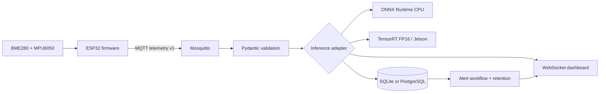

# EdgeSense Forge — Portfolio Case Study

EdgeSense Forge is an end-to-end Edge AI condition-monitoring prototype: an ESP32
publishes BME280/MPU6050 telemetry over MQTT, a FastAPI edge service validates and
scores it with ONNX Runtime or TensorRT, and operators investigate persisted alerts.

## Architecture

## What this demonstrates

- A real IoT message contract shared by simulator and ESP32 firmware.
- Honest capability detection: TensorRT numbers appear only when measured on Jetson.
- Reproducible warm-up and P50/P95 comparisons with thermal/power evidence.
- Production-minded persistence: PostgreSQL pooling, constraints, partial indexes,
  keyset pagination, configurable retention and load testing.
- An operator loop: detect → acknowledge → annotate → resolve → export.

## Evidence checklist

- `npm test` passes model, schema, inference, storage and workflow tests.
- `scripts/load_test.py` reports write throughput and P95.
- `jetson/validate_on_jetson.sh` produces a timestamped evidence package.
- `firmware/` compiles for ESP32 DevKit V1; physical sensor validation is separate.

See [DEMO_SCRIPT.md](DEMO_SCRIPT.md), [DEPLOYMENT.md](DEPLOYMENT.md), and
[PERFORMANCE.md](PERFORMANCE.md).
